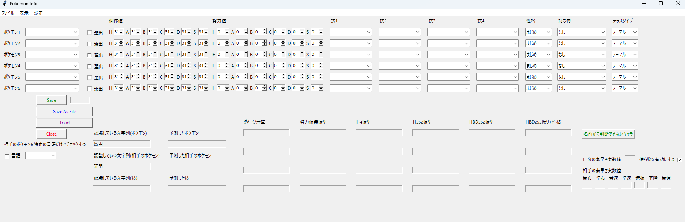
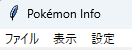
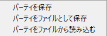
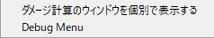
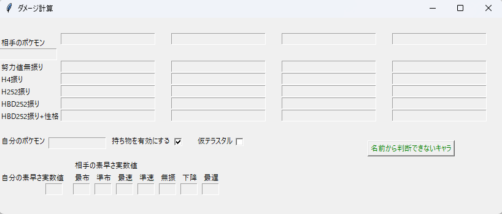
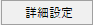

# Pokemon Info
ポケモンSVのランク対戦において自動でダメージ計算をしてくれるツールです
Windowsのみ対応してます
キャプチャーボードなどが必要です

# Usage(使い方)
まず、仮想カメラにSVの画面を映してください\
[詳しいやり方](https://style1925.hateblo.jp/entry/obs-virtual-camera)\
[うまく動かない/カメラが読み込めなかった場合](https://github.com/tororo1066/pokemon_info/wiki/%E3%82%AB%E3%83%A1%E3%83%A9%E3%81%8C%E3%81%86%E3%81%BE%E3%81%8F%E8%AA%AD%E3%81%BF%E8%BE%BC%E3%82%81%E3%81%AA%E3%81%84%E6%99%82%E3%81%AB)\
\
これがメインの画面です
\
上半分には対戦で使うポケモンのデータを入れます\
Saveでプログラムが読み込んでくれます\
Save As Fileをクリックすればファイルとして保存でき、次からLoadで読み込めます\
\
タブの説明\

## ファイル
\
**パーティを保存**: Saveと同じです\
**パーティをファイルとして保存**: Save As Fileと同じです\
**パーティをファイルから読み込む**: Loadと同じです

## 表示
\
**ダメージ計算のウィンドウを個別で表示する**: ダメ計をコンパクトに表すウィンドウを表示します
[詳しくはこちら](https://github.com/tororo1066/pokemon_info/wiki/%E3%83%80%E3%83%A1%E3%83%BC%E3%82%B8%E8%A8%88%E7%AE%97%E3%81%AE%E8%A6%8B%E6%96%B9)

**Debug Menu**: デバッグ用のメニューです 触らなくて大丈夫です

## 設定
\
**詳細設定**: [詳細設定](https://github.com/tororo1066/pokemon_info/wiki/%E8%A9%B3%E7%B4%B0%E8%A8%AD%E5%AE%9A)を開きます

# ダメージ計算の見方
[ここを参照](https://github.com/tororo1066/pokemon_info/wiki/%E3%83%80%E3%83%A1%E3%83%BC%E3%82%B8%E8%A8%88%E7%AE%97%E3%81%AE%E8%A6%8B%E6%96%B9)

# 将来的に対応したい...もの
- 被ダメージ計算
- 特性考慮